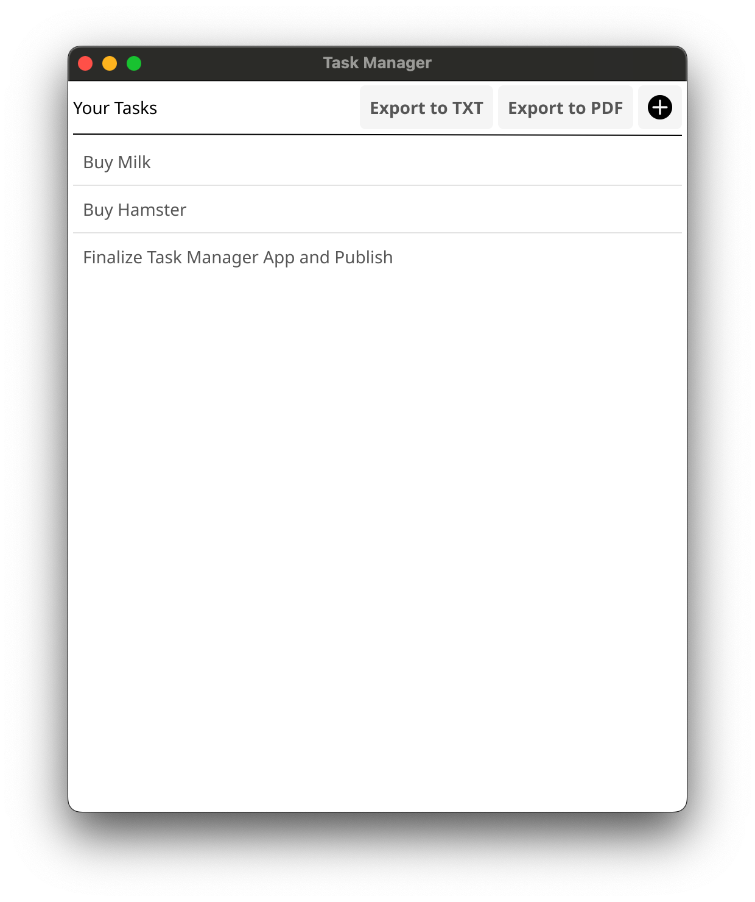
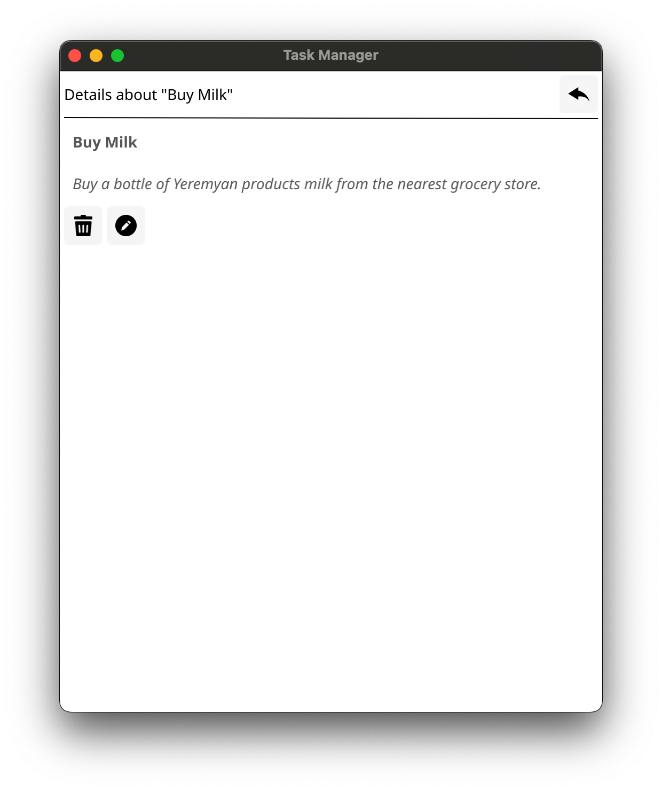
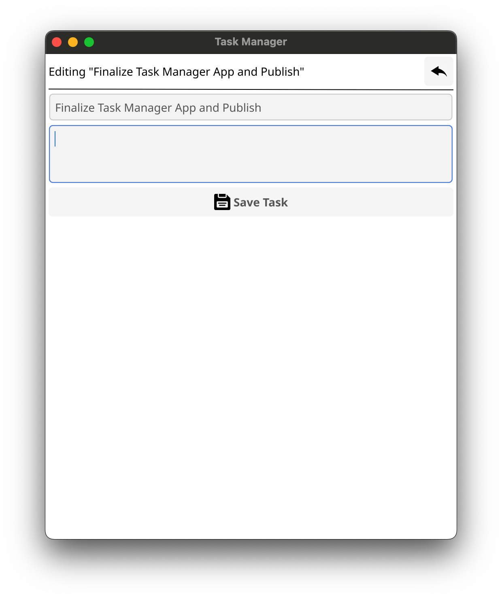

# Todo

<div align="center">
  
  
  
</div>

<div align="center">
  
  
</div>

<p align="center">
  Simple and easy to use GUI task management utility written in Go with fyne library and SQLite. Includes export to PDF and TXT functionalities.
</p>

## Overview
_todo_ is a lightweight, user-friendly, and efficient task management application written in Go. It offers a simple and intuitive interface for managing and storing your tasks. The app is built in under 1000 lines of code, making it easy to maintain and modify.

It supports persissting tasks via **SQLite** database, so you can easily access and manage your tasks even when the app is closed.

The application has been developed in one single file and the source code is very easy to understand and extensible and it is easy to add or change features if you have some knowledge in Go.

## UI
The UI of the application is built with help of [fyne](https://fyne.io/) library which provides _Material Design_ Kit and uses OpenGL.

## Installing and Running
```bash
git clone https://github.com/AlbertArakelyan/todo-go
cd todo-go
go mod tidy
go run main.go
```
